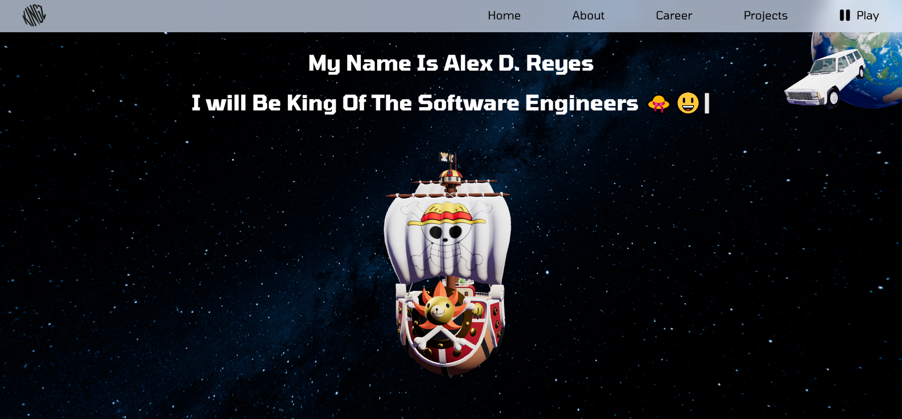
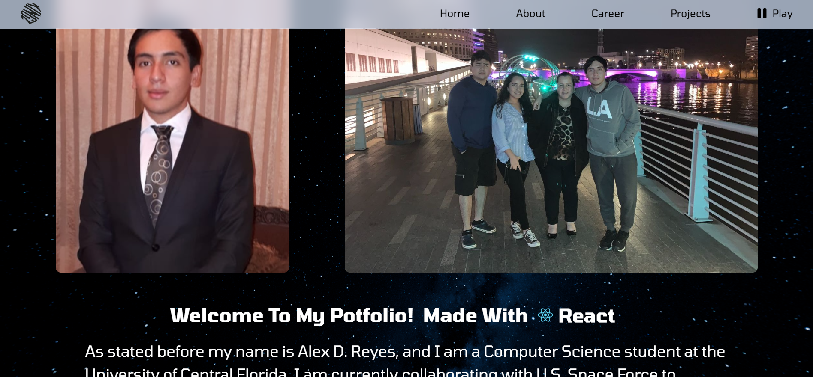
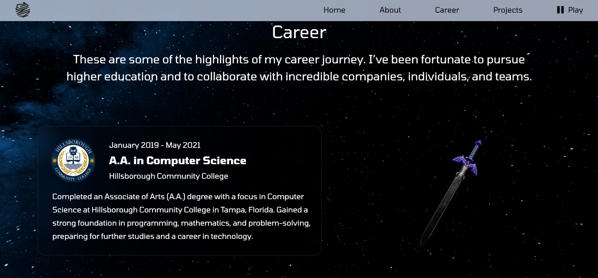
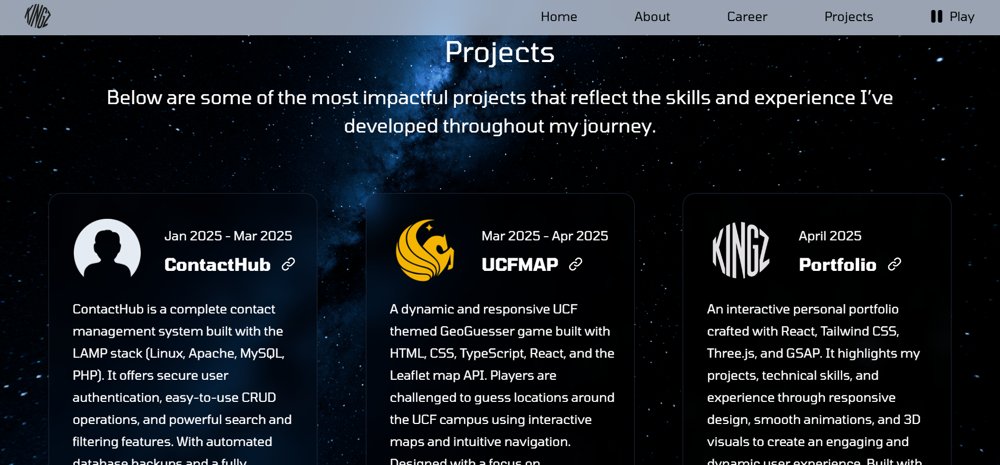
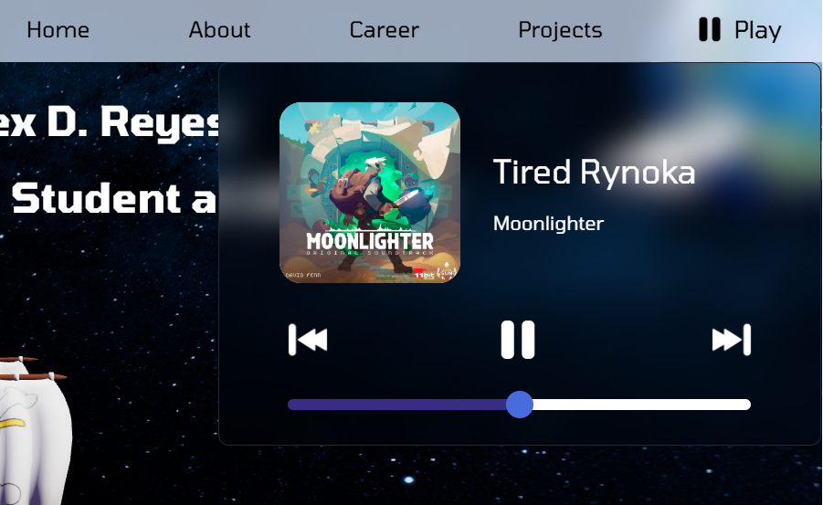

# Welcome To My Portfolio! Made With React + Tailwind + Three.js + GSAP + TypeScript + Node.js + Vite

🌐 My Developer Portfolio
This is my personal portfolio website. It showcases my projects, skills, and experience through an interactive and dynamic user experience. If you are coming from my portfolio welcome to inception 🤑 if you are not ignore this 😭.

## Home

  

## About

  

## Career

  

## Projects

  

## Music Player

  

 
 

✨ **Key Features:**

Responsive design for all devices

Smooth animations and transitions powered by GSAP

3D graphics and models integrated using Three.js

Modern UI/UX with Tailwind CSS

Project gallery, skill badges, and interactive sections

 
 

🚀 **Technologies Used:**

React – Front-end framework

Tailwind CSS – Utility-first styling

Three.js – 3D rendering and animations

GSAP – Advanced animations and timeline control

 
 

🔗 View Live Portfolio Demo: [https://alexdreyesz.com](https://alexdreyesz.com)
